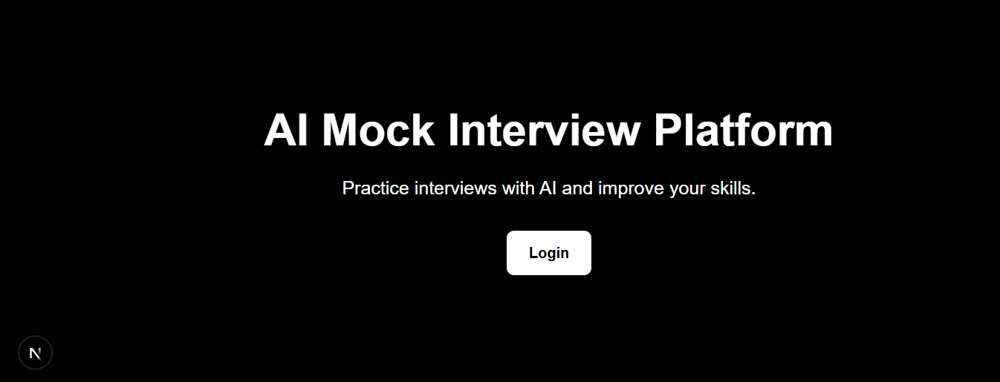
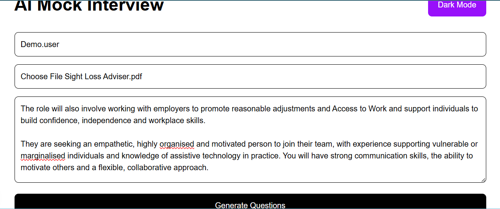
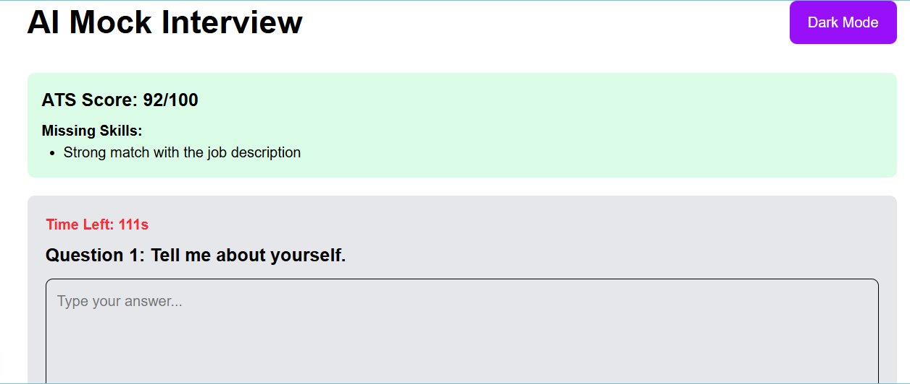
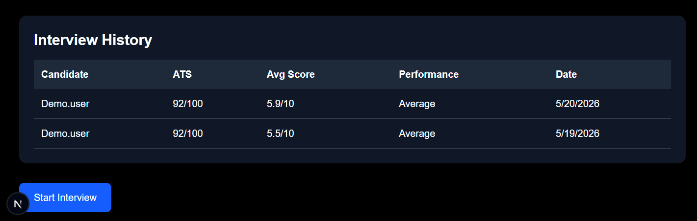
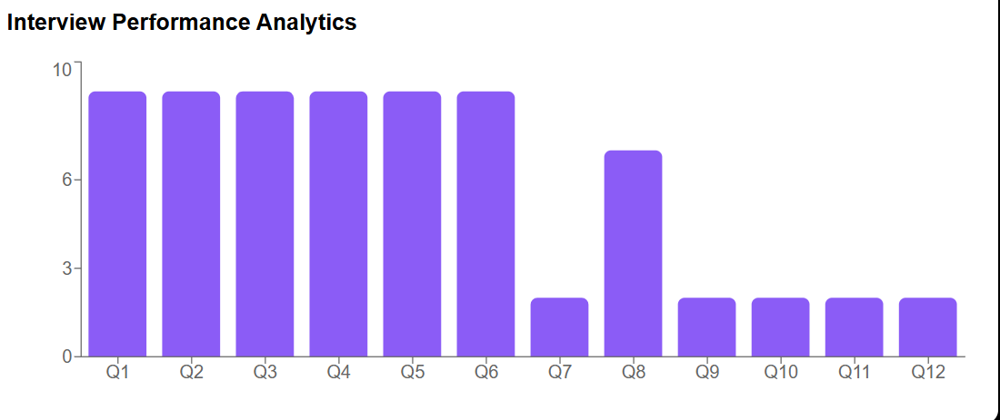
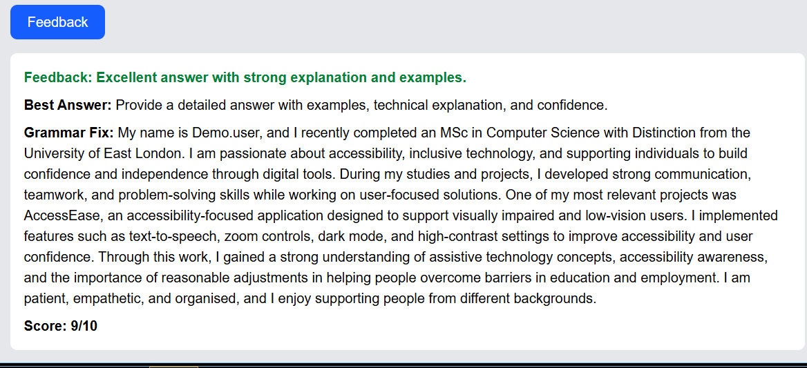
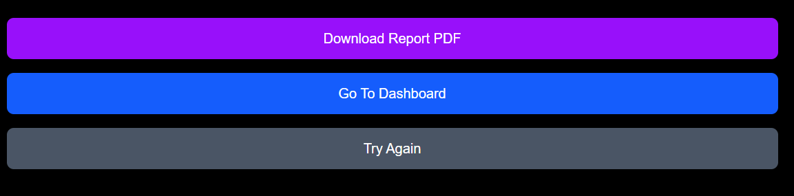

# AI Mock Interview Platform

An AI-powered interview preparation platform built using Next.js, Firebase, and TypeScript.

## Features

- AI-generated interview questions
- ATS resume scoring
- Missing skills analysis
- Real-time interview timer
- Dark mode support
- Performance analytics charts
- Interview history dashboard
- PDF interview report export
- Firebase Authentication

---

## Tech Stack

- Next.js
- TypeScript
- Firebase
- Tailwind CSS
- Recharts
- jsPDF

---

## Screenshots

### Home Page


### Login Form


### Interview Setup


### Live Interview Questions


### Dashboard with Dark Mode


### Interview History


### Interview Performance Analytics


### Final Interview Report


### Feedback Section


### PDF Export Actions

---

## Live Demo
https://ai-mock-interview-umber-five.vercel.app

## Run Locally

```bash
npm install
npm run dev